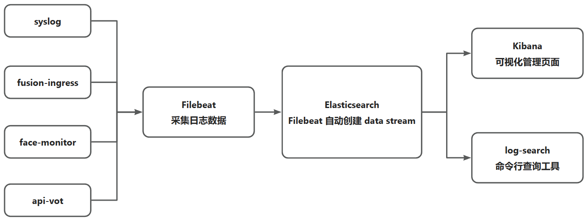
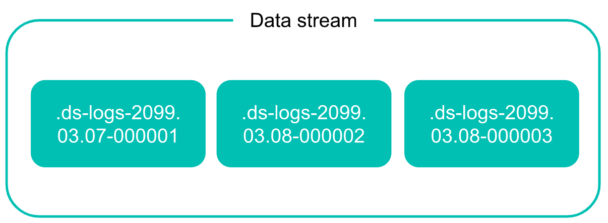

#  日志系统安装配置和使用

## 1.  架构设计

### 1.1  架构图



### 1.2 简要说明

​	Filebeat 采集日志数据并按照规范将日志数据写入 Elasticsearch ，Filebeat 自动创建 data stream , Kibana 是一个数据分析和可视化平台，可以使用 Kibana 对 Elasticsearch 索引中的数据进行搜索、查看、交互操作，注意 Kibana 和 Elasticsearch 的版本需要保持一致。log-search 是一个命令行工具，可以通过指定参数，实现不同的查询需求。

## 2. 日志数据规范

	1. 标准日志数据字段名称和字段数据类型见下表，数据格式为 json 。

| 字段名  | 数据类型 |
| ------- | -------- |
| level   | string   |
| time    | string   |
| caller  | string   |
| message | string   |

2. 标准日志数据示例

```json
{
    "level":"ERROR",
    "time":"2023-04-10T16:12:27.871+0800",
    "caller":"pool/recognition_pool.go:85",
    "message":"recognition server check: http://192.168.7.214:80/"
}
```


## 3. Elasticsearch 索引结构

### 3.1 索引结构

| **序号** | **字段名**      | **字段类型** | **说明**                             |
| -------- | --------------- | ------------ | ------------------------------------ |
| **1**    | time            | date         | 日志打印时间, 最高精确到毫秒         |
| **2**    | level           | keyword      | 日志级别 Debug Info Warn Error Fatal |
| **3**    | message         | text         | 日志内容                             |
| **4**    | host            | keyword      | 主机名或地址                         |
| **5**    | log_path        | keyword      | 日志文件路径                         |
| **6**    | module          | keyword      | 所属模块                             |
| **7**    | output_location | keyword      | 日志输出位置                         |

### 3.2 Data stream 机制

​	Data stream 机制是 Elasticsearch 设计来处理时间相关数据的，数据只能追加写入 Data stream 中，不能修改和更新。Data stream 名是一个逻辑索引名，Elasticsearch 自动创建并管理物理索引。 Data stream 的查询用法与 index 相同，查询时 Elasticsearch 会查询所有物理 index，追加插入的时候 Elasticsearch 插入最新的物理 index 中。使用 Data stream 机制之后不需要指定索引名中的年月份了，只需要指定索引名即可，比如 logs-202303 -> logs， Elasticsearch 自动滚动管理数据。



### 3.3 创建时间策略

​	 Elasticsearch 自动滚动管理日志，最新数据追加到最新的物理索引中，删除最旧的物理索引和数据，时间策略就是用来指定保存多长时间的。

```bash
PUT _ilm/policy/logs_policy
{
  "policy": {
    "phases": {
      "hot": {                                
        "actions": {
          "rollover": {
            "max_primary_shard_size": "50GB", 
            "max_age": "10d"
          }
        }
      },
      "delete": {
        "min_age": "30d",               
        "actions": {
          "delete": {}                        
        }
      }
    }
  }
}
```

- 当物理索引的主分片大小达到 50GB 或物理索引创建时间达到 10 天会创建新的物理索引。
- 当热数据保存时间达到 30d 的时候，物理索引状态会转为 delete 状态并随后删除掉。

### 3.4 创建 index template

```bash
PUT _index_template/logs_template
{
  "index_patterns": ["logs"],                   
  "data_stream": { },
  "template": {
    "settings": {
      "settings":{
        "analysis":{
            "filter": {
                "english_stop": {
                    "type":       "stop",
                    "stopwords":  "_english_" 
                }
            },
            "normalizer": {
                "lowercase_normalizer": {
                    "type": "custom",
                    "filter": [
                        "lowercase"
                    ]
                }
            },
            "analyzer":{
                "ik_analyzer":{ 
                    "type":"custom",
                    "tokenizer":"ik_max_word",
                    "filter":[
                        "lowercase",
                        "english_stop"
                    ]
                },
                "ik_search_analyzer":{ 
                    "type":"custom",
                    "tokenizer":"ik_smart",
                    "filter":[
                        "lowercase"
                    ]
                }
            }
        },
      "number_of_shards": 1,
      "number_of_replicas": 1,
      "index.lifecycle.name": "logs_policy"     
    },
    "mappings": {
        "dynamic":false,
        "properties":{
            "time":{
                "type":"date"
            },  
            "level":{
                "type":"keyword",
                "normalizer": "lowercase_normalizer"
            }, 
            "message":{
                "type":"text",
                "analyzer": "ik_analyzer",
                "search_analyzer": "ik_search_analyzer"
            },
            "host":{
                "type":"keyword"
            }, 
            "log_path":{ 
                "type": "keyword",
            }, 
            "module":{
                "type": "keyword"
            }, 
            "output_location":{
                "type": "keyword",
                "index": false
            }
        }
    }
  }
}
```

- 主要注意 `index_patterns` , `index.lifecycle.name` 字段。
- `index_patterns` 字段是用来匹配索引名的，可以使用正则表达式，比如 `logs-*`，当数据输入的时候指定 `logs-test` 就会匹配到这个 index template 。
- `index.lifecycle.name` 是用来指定时间策略的，就是上一步创建的时间策略。

## 4. Filebeat 安装配置和使用

### 4.1 下载 Filebeat 安装包并解压

```bash
tar xvzf filebeat-8.6.2-linux-x86_64.tar.gz -C /opt/ 
```

### 4.2 修改配置文件

#### 4.2.1 修改 filebeat.yml 配置文件

```yaml
filebeat.modules:
  - module: system
    syslog:
    ## 如果需要采集系统 syslog 日志, 将 enable 改为 true
      enabled: false
    ## 修改 var.paths 为 syslog 日志文件
      var.paths: ["/var/log/syslog*"]
# ============================== Filebeat modules===============================

# ============================== Filebeat inputs ===============================

filebeat.inputs:
  - type: filestream
    id: fusion-ingress
    enabled: true
    paths:
# ** 修改为 fusion-ingress.log 的实际路径 ** 
      - /opt/fusion-ingress-1.0.0-beta-amd64/logs/fusion-ingress.log
    parsers:
      - ndjson:
          target: ""
          message_key: message
    processors:
      - add_fields:
          target: ""
          fields:
            module: "fusion-ingress"
  - type: filestream
    id: api-vot
    enabled: true
    paths:
# ** 修改为 api_vot 的实际路径 ** 
      - /opt/message/api-vot/logs/api_vot.log
    parsers:
      - ndjson:
          target: ""
          message_key: message
    processors:
      - add_fields:
          target: ""
          fields:
            module: "fusion-ingress"


setup.template.fields: "${path.config}/fields.yml"


output.elasticsearch:
# ** 修改为 es 集群地址 **
  hosts: ["localhost:9200"]

  # Protocol - either `http` (default) or `https`.
  protocol: "http"
  allow_older_versions: true
  
processors:
  - drop_fields:
      fields: ["log", "host", "input", "agent", "ecs"]
  - add_fields:
      target: ""
      fields:
# ** 修改为 filebeat 所在机器的主机名或者 ip 地址 ** 
        host: "ecs16"
        
# ====================== Index Lifecycle Management (ILM) ======================

# Configure index lifecycle management (ILM) to manage the backing indices
# of your data streams.

# Enable ILM support. Valid values are true, false.
setup.ilm.enabled: true

# Set the lifecycle policy name. The default policy name is
# 'beatname'.
setup.ilm.policy_name: "filebeat"

# The path to a JSON file that contains a lifecycle policy configuration. Used
# to load your own lifecycle policy.
setup.ilm.policy_file: ${path.config}/ilm.json

# Disable the check for an existing lifecycle policy. The default is true. If
# you disable this check, set setup.ilm.overwrite: true so the lifecycle policy
# can be installed.
setup.ilm.check_exists: true

# Overwrite the lifecycle policy at startup. The default is false.
setup.ilm.overwrite: false

```

#### 4.2.2 修改 ilm.json 

```json
{
  "policy": {
    "phases": {
      "hot": {
        "min_age": "0ms",
        "actions": {
          "rollover": {
            "max_age": "7d",
            "max_primary_shard_size": "50gb"
          }
        }
      },
      "delete": {
        "min_age": "180d",
        "actions": {
          "delete": {
            "delete_searchable_snapshot": true
          }
        }
      }
    }
  }
}
```

### 4.3 命令行启动 Filebeat

1. 使用`screen -S filebeat `或者 `tmux new-session -s filebeat`启动会话  。

2. `./filebeat -c ./filebeat.yml -e ` 启动 Filebeat 。

3. 查看控制台是否有报错，如果没有，可以查看 Elasticsearch 中是否有日志，一般来说如果正常的话，Elasticsearch 中已经写入日志。

### 4.4 添加其他服务

如果有服务的日志满足 Elasticsearch 索引要求

1. 可以复制 `filebeat.inputs`中的部分
2. 修改 id 与其他日志部分不同
3. 修改  paths 中的文件路径为日志路径
4. 修改 module 为当前模块的名称

```yaml
filebeat.inputs:
# .....
  - type: filestream
    id: myservice
    enabled: true
    paths:
# ** 修改为 fusion-ingress.log 的实际路径 ** 
      - /opt/myservice/logs/myservice.log
    parsers:
      - ndjson:
          target: ""
          message_key: message
    processors:
      - add_fields:
          target: ""
          fields:
            module: "myservice"
# ...
```


## 5. log-search 命令行查询工具

### 5.1 安装

1. 安装包位置
   - 主机：192.168.11.12   
   - 文件目录： /opt/log-tool/log-search.zip
2. 解压安装包后进入 log-search 目录，执行 ./log-search 文件开始使用。

### 5.2 主要功能

​	工具的主要功能是用命令行的方式实现对日志的查询，可以通过指定模块名、时间段、日志级别、首尾日志条数等，很方便的查询相关的日志内容，可以通过指定 display 参数选择日志文本在控制台的展示方式，table 表示以表格显示，json 表示以 json 格式显示。

### 5.3 参数设置

​	通过 ./log-search --help 的方式可以获取帮助信息，日志数据默认以时间降序排列，默认显示最新的日志数据。可以选择以 json 或者表格方式显示，当数据较多的时候，表格显示比较乱，默认以 json 方式显示，下表为各个参数及其快捷方式和取值。

| 参数      | 快捷方式 | 对应操作                   | 参数取值                                   |
| --------- | -------- | -------------------------- | ------------------------------------------ |
| --help    | -h       | 打印命令行工具帮助信息     |                                            |
| --host    | -p       | 指定查询的主机名           | 如：ecs17                                  |
| --level   | -l       | 指定所查询日志内容的级别   | DEBUG INFO WARN ERROR FATAL                |
| --match   | -k       | 指定查询日志时的关键字     | 根据需要制定模糊查询关键字                 |
| --module  | -m       | 指定模块名                 | syslog  vot  fusion  face 分别对应四个模块 |
| --since   | -s       | 指定开始时间点             | 2023-03-04T17:48:02+08:00                  |
| --until   | -u       | 指定结束时间点             | 2023-04-04T17:48:02+08:00                  |
| --tail    | -t       | 指定查看尾部的数据条数     | int  如：10 表示显示尾部10条数据           |
| --display | -d       | 指定数据在控制台的显示方式 | table  json                                |
| --head    | -f       | 指定查询头部的数据条数     | int  如：10 表示显示头部10条数据           |
| --version | -v       | 版本信息                   |                                            |

### 5.4 用法示例

```bash
# 帮助
./log-search --help
./log-search -h
# 查看版本号
./log-search --version
# 聚合统计 按照模块、级别、或多字段统计日志数量 不加时间范围按照默认来
./log-search --by module
./log-search --by level
./log-search --by module,level
# 查询日志 必须指定模块名
./log-search --module <model-name> 
# 查询日志 指定级别
./log-search --module <model-name> --level <LEVEL>
# 查询日志 指定机器
./log-search --module <model-name> --host <hostname> --level <LEVEL>
# 查询日志 按照内容匹配
./log-search --module <model-name> --level <LEVEL> --match <keyword>
# 查询日志 指定时间范围
./log-search --module <model-name> --since="2023-03-01T08:00:00" --until="2023-03-01T13:00:00"
# 查询日志 只指定开始时间 则结束时间为现在
./log-search --module <module-name> --since="2023-03-01T08:00:00"
# 查询日志 可以只指定日期 自动按照当天零点处理
./log-search --module <module-name> --since="2023-03-01"
# 查询日志 最近 30 分钟
./log-search --module <module-name> --since 30m
# 查询日志 最近 2.5 小时
./log-search --module <module-name> --since 2h30m
# 指定只看头部的条数 (限制查询条数)
./log-search --module <module-name> --since 30s --head=100
# 指定只看尾部的条数
./log-search --module <module-name> --tail=100
# 指定只看尾部数据的条数，指定显示方式为表格
./log-search --module <module-name> --tail=100 --display table
```


